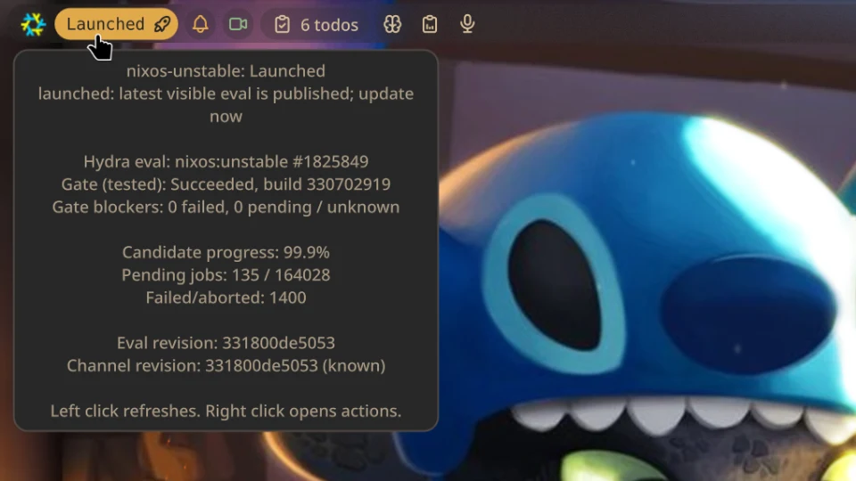

# Hydra Update Examiner

Native Noctalia v5 port of the Hydra Update Examiner bar widget. It estimates
how close a NixOS or Nixpkgs channel is to publishing its next update.



> This is a v5 beta staging build. The thumbnail comes from the v4 widget and
> should be replaced after an interactive native v5 capture using the intended
> production theme and layout.

## Plugin

| Field | Value |
| --- | --- |
| ID | `goober/hydra-update-examiner` |
| Entries | Bar widget: `hydra`; actions panel: `actions`; service: `status` |

The singleton service polls Hydra once for all widget placements. Channel,
refresh, and threshold controls are plugin-wide; text, colors, glyphs, and
gesture bindings belong to each bar placement.

## What it does

The plugin checks public NixOS channel and Hydra endpoints. It displays a
readiness score in the bar and switches to `Launched` when the latest visible
evaluation revision matches the published channel revision.

The score combines:

- Candidate evaluation progress.
- Channel-gate status, such as `tested` or `unstable`.
- Failed and pending gate constituent builds.
- The published revision from `channels.nixos.org`.

This is a heuristic. Hydra does not publish a single authoritative estimate of
when a channel will advance.

## v5 architecture

- `service.luau` is a singleton that schedules refreshes and publishes status.
- `widget.luau` is a thin bar client watching the shared status channel.
- `panel.luau` is the native attached action surface opened by right click.
- `plugin.toml` generates native settings UI; there is no QML settings page.
- `scripts/hydra-channel-progress` is the request-budgeted shell backend.

One service feeds every widget placement, avoiding duplicate requests when the
widget appears on multiple bars or monitors. Failed refreshes keep the last
successful result visible and mark it stale.

## Usage

Add the published repository as a custom Noctalia v5 Git source, then enable
the plugin:

```bash
noctalia msg plugins source add goober-v5 git https://github.com/Go08er/goober-noctalia-plugins-v5
noctalia msg plugins enable goober/hydra-update-examiner
noctalia msg plugins list
```

Then add `goober/hydra-update-examiner:hydra` through the bar widget picker.
The equivalent graphical flow is **Settings** → **Plugins** → add source:
choose **Git**, name it `goober-v5`, enter
<https://github.com/Go08er/goober-noctalia-plugins-v5>, and enable
`goober/hydra-update-examiner` after the source loads.

For a declarative configuration, the relevant shape is:

```toml
[plugins]
enabled = ["goober/hydra-update-examiner"]
auto_update = true

[[plugins.source]]
name = "goober-v5"
kind = "git"
location = "https://github.com/Go08er/goober-noctalia-plugins-v5"
enabled = true

[widget.hydra-readiness]
type = "goober/hydra-update-examiner:hydra"
display_mode = "on_hover"
running_glyph = "server-bolt"

[plugin_settings."goober/hydra-update-examiner"]
refresh_interval_minutes = 60
```

Add `hydra-readiness` to the desired bar section using your existing bar
configuration. Retain any other `[[plugins.source]]` entries you use when
managing the configuration declaratively.

Refresh the Git source with the Settings source refresh control or:

```bash
noctalia msg plugins update goober-v5
```

To remove it:

```bash
noctalia msg plugins disable goober/hydra-update-examiner
noctalia msg plugins source remove goober-v5
```

For development, clone the repository and use its root as a path source instead:

```bash
noctalia msg plugins source add goober-v5-dev path /absolute/path/to/goober-noctalia-plugins-v5
noctalia msg plugins enable goober/hydra-update-examiner
```

Do not use `hydra-update-examiner/` itself as the path source: Noctalia expects
the source root containing `catalog.toml`.

## Controls and IPC

- Left click: refresh, subject to a 30-second cooldown.
- Right click: open the native actions panel, with Refresh, Open Hydra, Polling
  settings, and Documentation commands.
- Middle click: use Noctalia's built-in binding to open this placement's widget
  settings.

Left and right are native plugin action defaults, while middle is Noctalia's
host default. All three are visible and independently overridable in this
placement's **Actions** section.

The singleton service can also be driven directly:

```bash
noctalia msg plugin goober/hydra-update-examiner:status all refresh
noctalia msg plugin goober/hydra-update-examiner:status all force-refresh
noctalia msg plugin goober/hydra-update-examiner:status all open
```

Both refresh IPC actions bypass the network-data TTLs; `force-refresh` also
bypasses the 30-second click cooldown. Scheduled polls continue to use cache.

The actions panel is also addressable for testing or automation:

```bash
noctalia msg panel-toggle goober/hydra-update-examiner:actions
noctalia msg plugin goober/hydra-update-examiner:actions all documentation
```

## Settings

Hydra follows Noctalia v5's two settings scopes instead of duplicating the same
controls in both menus.

Open the plugin's gear under **Settings** → **Plugins**, or choose **Polling
settings** in the right-click panel, for the four values owned by the singleton
service:

| Setting | Type | Default | Description |
| --- | --- | --- | --- |
| `channel_preset` | `select` | `nixos-unstable` | Selects a supported NixOS or Nixpkgs channel, or exposes `custom_channel`. |
| `custom_channel` | `string` | empty | Exact supported channel name used only when `channel_preset` is `custom`; this is not an arbitrary Hydra URL. |
| `refresh_interval_minutes` | `int` | `60` | Poll interval in minutes, from 1 through 1440. |
| `close_threshold` | `int` | `90` | Readiness percentage, from 1 through 100, at which the close state begins. |

### Widget appearance and glyph picker

Middle-click a Hydra widget to open that placement's settings. If its normal
middle-click binding was changed, open the widget's gear under **Settings** →
**Bar**. All presentation controls are together there:

| Setting | Type | Default | Description |
| --- | --- | --- | --- |
| `display_mode` | `select` | `always` | `on_hover`, `always`, or `icon_only` readiness text for this placement. |
| `running_color` | `color` | `secondary` | Normal-progress color for this placement. |
| `stalled_color` | `color` | `error` | Blocked, stale, or error color for this placement. |
| `close_color` | `color` | `tertiary` | Near-readiness color for this placement. |
| `launched_color` | `color` | `primary` | Publication color for this placement. |
| `running_glyph` | `glyph` | `server-bolt` | Normal-progress glyph selected with the adjacent picker button. |
| `stalled_glyph` | `glyph` | `server-off` | Blocked, stale, or error glyph selected with the adjacent picker button. |
| `close_glyph` | `glyph` | `server-spark` | Near-readiness glyph selected with the adjacent picker button. |
| `launched_glyph` | `glyph` | `rocket` | Publication glyph selected with the adjacent picker button. |

Press the button adjacent to a glyph field to open Noctalia's searchable
**Pick a Glyph** menu. The picker is not arbitrarily restricted by Hydra:
Noctalia v5 currently attaches it to widget-scoped glyph controls, while a
root plugin `glyph` setting renders as a text field. Keeping glyphs here gives
the complete native picker and lets two Hydra placements deliberately look
different.

Click, scroll, and thumb-button bindings are also per placement in the same
widget editor. This is the v5 convention: service configuration is shared by
the plugin, while presentation and gestures describe a particular bar widget.

Noctalia sends pointer enter/leave events to the widget, so `on_hover` behaves
like v4: the glyph remains visible and the readiness text expands only while
the pointer is over the widget.

### Migrating v4 appearance

Noctalia cannot import the old values automatically because v4 used a different
plugin ID, settings store, and camelCase key names. Re-enter appearance values
in each widget's settings using this mapping:

| v4 key | v5 target |
| --- | --- |
| `percentDisplayMode` | Widget `display_mode` (`onhover` → `on_hover`, `alwaysShow` → `always`, `alwaysHide` → `icon_only`) |
| `runningColor` | Widget `running_color` |
| `stalledColor` | Widget `stalled_color` |
| `closeColor` | Widget `close_color` |
| `launchedColor` | Widget `launched_color` |
| `runningIcon` | Widget `running_glyph`, selected with the native picker |
| `stalledIcon` | Widget `stalled_glyph`, selected with the native picker |
| `closeIcon` | Widget `close_glyph`, selected with the native picker |
| `launchedIcon` | Widget `launched_glyph`, selected with the native picker |

V0.4.0 removes the temporary `shared_*` appearance settings and the two
inheritance switches from v0.2/v0.3. Existing local `display_mode`, color, and
glyph values remain the active widget settings; obsolete shared keys can be
deleted from handwritten configuration.

## Supported channels

| Channel | Hydra jobset | Gate job |
| --- | --- | --- |
| `nixos-unstable` | `nixos:unstable` | `tested` |
| `nixos-unstable-small` | `nixos:unstable-small` | `tested` |
| `nixos-stable` | Current supported `nixos-YY.MM` | `tested` |
| `nixos-stable-small` | Current supported `nixos-YY.MM-small` | `tested` |
| `nixos-YY.MM` | `nixos:release-YY.MM` | `tested` |
| `nixos-YY.MM-small` | `nixos:release-YY.MM-small` | `tested` |
| `nixpkgs-unstable` | `nixpkgs:unstable` | `unstable` |

The exact-channel field is not a generic third-party Hydra URL. It accepts only
the public NixOS/Nixpkgs channels mapped by the backend.

## Requirements

The pinned test source is Noctalia tag `v5.0.0-beta.7`, whose project/runtime
version is `5.0.0`. The manifest targets plugin API level 15: API 14 provides
overridable widget gesture defaults, and API 15 provides the scoped
plugin-settings action used by the attached panel. This host supports
cumulative plugin API levels 3 through 20. The port also needs these commands
on `PATH`:

- `bash`
- `curl`
- `jq`
- `perl`
- `grep`
- `awk`
- `sed`
- `head`
- `tr`
- `date`
- `cat`
- `flock`
- `mkdir`
- `mv`
- `rm`
- `timeout`
- `xdg-open` for the right-click action

On typical Linux systems, `head`, `tr`, `date`, `cat`, `mkdir`, `mv`,
and `rm` are supplied by GNU coreutils. The `flock` command is supplied by
util-linux.

On NixOS, a minimal explicit addition for commonly missing tools is:

```nix
environment.systemPackages = with pkgs; [
  curl
  jq
  util-linux
  xdg-utils
];
```

The helper can be checked independently:

```bash
./scripts/hydra-channel-progress --channel nixos-unstable
python3 tests/test_request_budget.py
```

## Network behavior and limitations

The backend makes read-only public requests to `channels.nixos.org`,
`nix-channels.s3.amazonaws.com` for stable alias discovery, and
`hydra.nixos.org`. It uses Hydra JSON for build data and the compact HTML eval
list for candidate identity; Hydra's JSON eval list embeds millions of build
IDs and is not suitable for a 55-second widget backend. The eval page supplies
the grouped counts and revision in one response. Public services receive normal
connection metadata such as IP address and user agent.

There is a single in-process polling service and a click cooldown. A bounded,
single-entry cache and cross-process `flock` prevent overlapping helper
invocations from stampeding Hydra. The backend has a 55-second overall
deadline. Temporary Hydra outages keep the last known result visible with a
stale age when a cached result exists, or produce an error before the first
successful observation.

The fixed-slot cache is
`$XDG_CACHE_HOME/hydra-update-examiner/state.json`, falling back to
`~/.cache/hydra-update-examiner/state.json`. Schema 2 has a 64 KiB ceiling on
both reads and writes and stores only the current configured channel. It is safe
to delete this file while troubleshooting; the helper recreates it atomically.

Discovery is cached for the configured channel. Normal TTLs are six hours for
the channel revision, one hour for candidate identity, one minute for eval
counts, two hours for gate status, and six hours for constituents. Once eval
progress reaches the configured close threshold (or a gate is blocked), gate
and constituent TTLs tighten to five and fifteen minutes. A changed gate also
refreshes constituents immediately. A passed terminal gate checks the channel
revision every minute, while paused candidates check for a replacement eval
every five minutes. Conditional validators are not assumed for Hydra's dynamic
responses. Stable aliases normally keep their resolved release indefinitely;
if the expected May/November release does not exist yet, the cached fallback is
marked provisional and discovery retries once per day until it appears.

## Development note

The v5 port was prepared with OpenAI Codex assistance. It is available as a
standalone custom Git source and has not been submitted to an upstream
Noctalia catalog. The native beta.7/API 15 integration gate passed on
2026-07-31, including shared and local presentation, hover rendering, the
attached panel, its documentation and scoped-settings actions, hot reload, and
clean shutdown. The v0.3.0 harness additionally captures the widget settings
surface and opens Noctalia's native searchable **Pick a Glyph** menu. V0.4.0
streamlined the settings scopes; the request-budget refactor retains that
presentation while replacing the backend polling lifecycle.

## License

MIT. See `LICENSE`.
